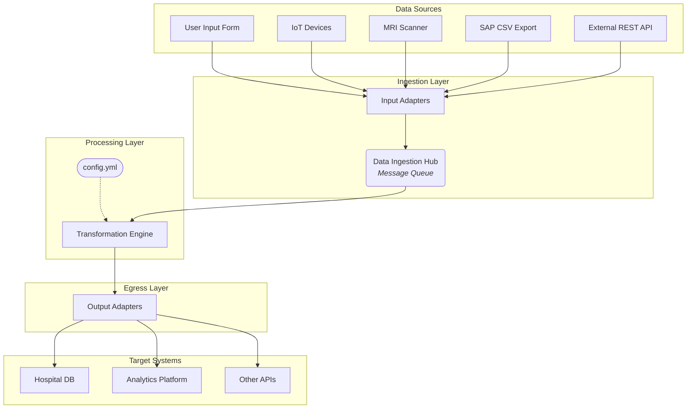

# EDC Lab Integration Architecture

This document outlines the architecture for an Electronic Data Capture (EDC) lab setup.

## 1. High-Level Architecture

The architecture is designed to be modular, scalable, and extensible, following common Enterprise Application Integration (EAI) patterns.



The system consists of the following key components:

### 1.1. Input Adapters

A set of independent services, each responsible for handling a specific data source:

*   **User Input Form:** A web-based form for manual data entry.
*   **Streaming Data (IoT):** A listener for data from devices like fever measurement tools (e.g., via MQTT).
*   **Image Data:** An endpoint for receiving image data from scanning devices (e.g., MRI).
*   **CSV Data (SAP):** A file watcher or scheduled job to process CSV files from an SAP system.
*   **REST API Feed:** An endpoint to receive data from external software.

### 1.2. Data Ingestion Hub

A central message queue (e.g., RabbitMQ, Kafka) that acts as a buffer and decouples the input adapters from the processing logic. All data from the input adapters is published to this hub.

### 1.3. Transformation Engine

A core service that subscribes to the Data Ingestion Hub. It consumes messages, applies a set of configurable transformation rules, and prepares the data for the target systems.

### 1.4. Output Adapters

A set of services that take the transformed data from the Transformation Engine and deliver it to the appropriate target systems using various transport protocols (e.g., HTTP, FTP, AMQP, etc.).

## 2. Technology Stack

The following technologies are recommended for a rapid prototype and scalable production system:

*   **Programming Language:** Python
*   **Web Framework (for APIs):** FastAPI
*   **Message Queue:** RabbitMQ or Kafka
*   **Data Transformation:** Pandas or custom Python scripts
*   **Configuration:** YAML (`config.yml`) or a dedicated configuration service.
*   **Frontend (for user form):** HTML, CSS, JavaScript

## 3. Data Flow

1.  **Data Ingress:** Each input adapter receives data in its specific format (e.g., JSON from a web form, binary data from an MRI scanner, CSV from SAP).
2.  **Standardization:** The input adapter may perform an initial transformation to a standardized internal format (e.g., a JSON object with common metadata) before publishing to the Data Ingestion Hub.
3.  **Queuing:** The standardized data is published as a message to a specific topic/queue in the message broker.
4.  **Processing:** The Transformation Engine consumes the message from the queue.
5.  **Transformation:** It applies business logic and transformation rules based on the configuration. This may involve data validation, enrichment, and reformatting.
6.  **Routing:** The engine determines the target system(s) for the transformed data.
7.  **Data Egress:** The data is sent to the appropriate Output Adapter.
8.  **Delivery:** The Output Adapter formats the data as required by the target system and delivers it using the correct protocol.

## 4. Configuration Example (`config.yml`)

```yaml
transformations:
  - source_type: "fever_device"
    rules:
      - type: "convert_celsius_to_fahrenheit"
        field: "temperature"
      - type: "add_metadata"
        timestamp_field: "capture_time"
    target: "hospital_db"

  - source_type: "sap_csv_import"
    rules:
      - type: "map_fields"
        mapping:
          "PatientID": "patient_identifier"
          "Value": "reading_value"
    target: "analytics_platform"

targets:
  - name: "hospital_db"
    protocol: "http"
    endpoint: "http://hospital-api.example.com/v1/records"
    credentials: "user:password"

  - name: "analytics_platform"
    protocol: "ftp"
    host: "ftp.analytics.example.com"
    path: "/incoming/lab_data/"
```
