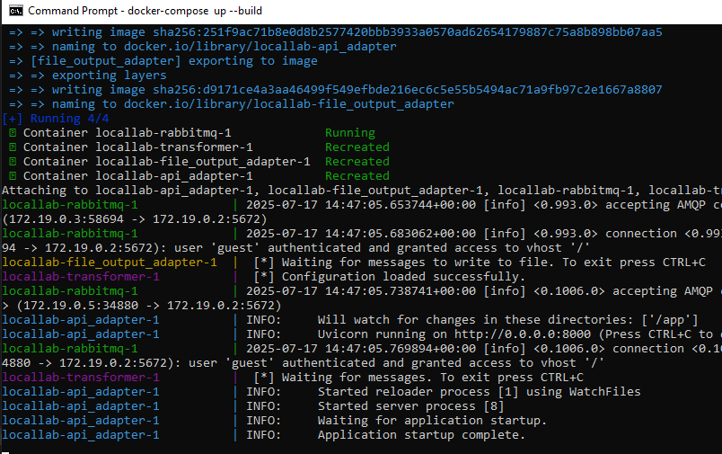
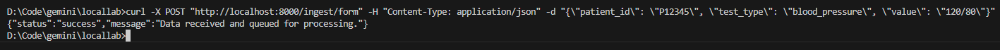
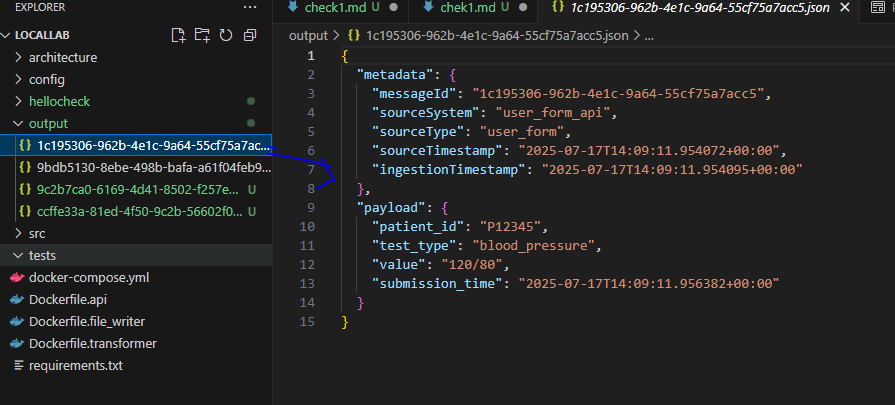
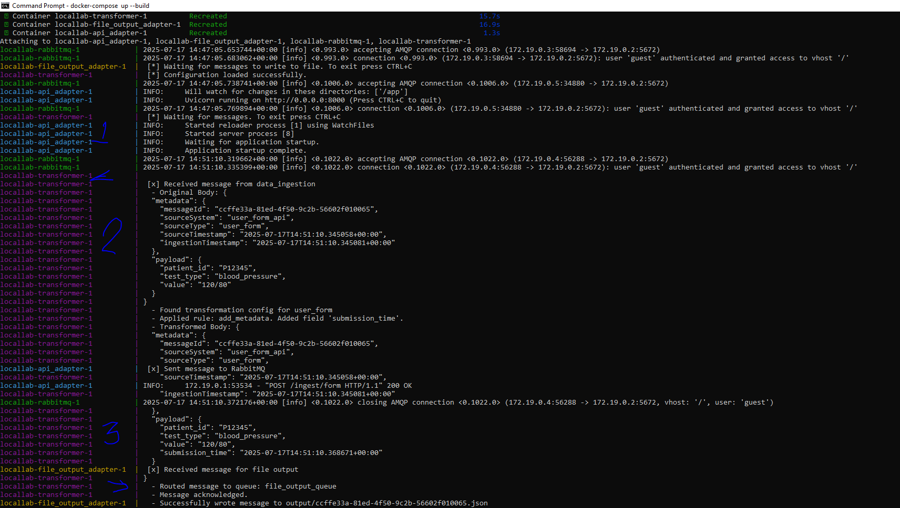
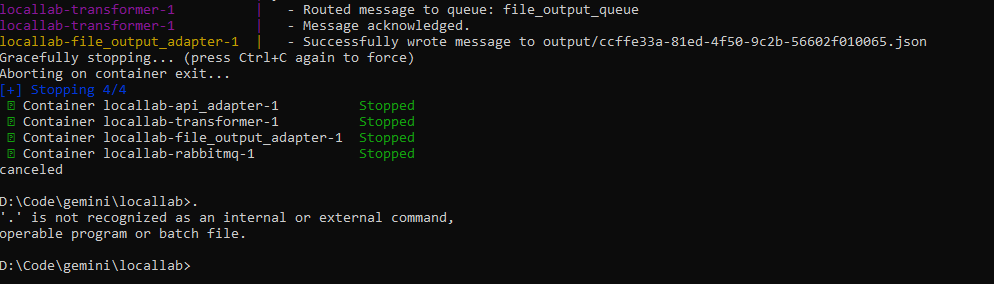

# Project Demonstration: EDC Integration Platform

This document outlines the steps to demonstrate the functionality of the EDC Integration Platform, from data ingestion to transformation and file output.

## Prerequisites

*   Docker Desktop installed and running.
*   Git installed.
*   The project repository cloned to your local machine.

## Setup and Execution Steps

### Step 1: Navigate to the Project Directory

Open your terminal or command prompt and navigate to the root directory of the `locallab` project.

```bash
cd D:\Code\gemini\locallab
```

### Step 2: Build and Start Docker Containers

Run the following command to build the Docker images and start all the services (RabbitMQ, API Input Adapter, Transformation Engine, and File Output Adapter) in detached mode.

```bash
docker-compose up --build -d
```

**Expected Output:** You should see messages indicating that the services are being created and started.

**Screenshot 1: `docker-compose up --build -d` output**


### Step 3: Verify Container Status

Check that all containers are running correctly.

```bash
docker-compose ps
```

**Expected Output:** All services should show `Up` in their status.

**Screenshot 2: `docker-compose ps` output**


### Step 4: Monitor Docker Logs (Initial State)

Start monitoring the logs of all services. This will show you the initial state of the services, particularly the `transformer` and `file_output_adapter` waiting for messages.

```bash
docker-compose logs --no-log-prefix
```

**Expected Output:** You should see messages like `[*] Waiting for messages.` from the `transformer` and `file_output_adapter`.

**Screenshot 3: Initial Docker Logs**

*(Insert screenshot of the terminal output showing initial logs, especially the waiting messages)*

### Step 5: Ingest Data via API

Open a **new terminal or command prompt window** (keep the logs monitoring in the first one) and send a POST request to the API Input Adapter. This simulates data coming from a user form.

```bash
curl -X POST "http://localhost:8000/ingest/form" -H "Content-Type: application/json" -d "{\"patient_id\": \"P12345\", \"test_type\": \"blood_pressure\", \"value\": \"120/80\"}"
```

**Expected Output:** The API should return a success message: `{"status":"success","message":"Data received and queued for processing."}`

**Screenshot 4: `curl` command and its output**



### Step 6: Observe Data Flow in Logs

Switch back to the terminal where you are monitoring the Docker logs. You should now see the message flowing through the pipeline:

*   The `api_adapter` receiving the request.
*   The `api_adapter` publishing the message to RabbitMQ.
*   The `transformer` receiving, transforming (adding `submission_time`), and routing the message.
*   The `file_output_adapter` receiving the transformed message and writing it to a file.

**Screenshot 5: Data Flow in Docker Logs**

*(Insert screenshot of the logs showing the message being processed by `transformer` and `file_output_adapter`)*

### Step 7: Verify File Output

Check the `output` directory in your project. A new JSON file should have been created with a UUID as its name (e.g., `xxxxxxxx-xxxx-xxxx-xxxx-xxxxxxxxxxxx.json`).

```bash
dir output
# or for Linux/macOS
# ls output
```

**Expected Output:** You should see the newly created JSON file.

**Screenshot 6: Contents of the `output` directory**



### Step 8: Inspect the Output File Content

Open the newly created JSON file (e.g., using `cat` or a text editor) to verify its content. It should contain the original data along with the `submission_time` added by the transformation engine.

```bash
type output\<YOUR_MESSAGE_ID>.json
# Replace <YOUR_MESSAGE_ID> with the actual filename
# For Linux/macOS: cat output/<YOUR_MESSAGE_ID>.json
```

**Expected Output:** The JSON content of the file, including the `submission_time` field.

**Screenshot 7: Content of the output JSON file**



## Cleanup (Optional)

To stop and remove all Docker containers and images:

```bash
docker-compose down --rmi all

```

This completes the demonstration of the EDC Integration Platform.